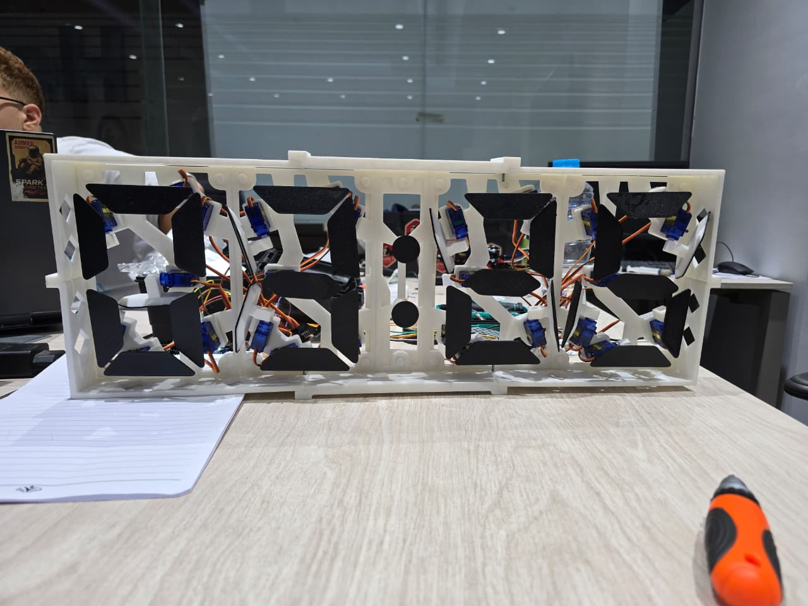
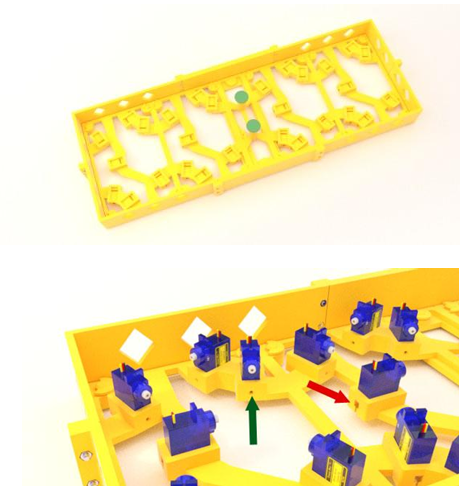

# Mechanical 7-Segment Display Clock — Arduino + Servo Motors + 3D Printing

A fully mechanical, **3D-printed digital clock** where each segment of every digit is physically flipped open or closed by an individual **servo motor** — no LEDs, no screens. The time is read from a real-time clock (RTC) module and displayed across four 7-segment digits (HH:MM) using **28 servo motors** driven by two PCA9685 PWM boards.

> **Course:** Mechatronics Design — Helwan National University, Robotics & Mechatronics Dept.  
> **By:** Yousef Ahmed Elbeltagy

---

## Photos

| Team with the Finished Clock | Clock Internals — 28 Servos |
|:---:|:---:|
|  |  |

**3D Design Render**



---

## How It Works

Each digit is a **physical 7-segment display** made of 3D-printed black flaps. Each of the 7 flaps (segments a–g) is attached to a servo motor — when the segment is **ON**, the servo rotates the flap to face forward (visible); when **OFF**, the flap rotates away (hidden).

```
DS1302 RTC Module  →  Arduino UNO
                           │
              ┌────────────┴────────────┐
              ▼                         ▼
   PCA9685 (0x40)               PCA9685 (0x41)
   Hours Driver                 Minutes Driver
   (14 servos)                  (14 servos)
        │                              │
   ┌────┴────┐                   ┌─────┴────┐
   HH Tens  HH Units             MM Tens   MM Units
  (7 servos)(7 servos)          (7 servos)(7 servos)
```

### Smart Middle-Segment Logic
The middle segment (G) of a 7-segment display is surrounded by segments B and F. Before moving the middle flap, the controller temporarily moves the adjacent flaps out of the way to avoid physical collision — then moves them back. This prevents the servos from jamming.

---

## Segment Layout

Each digit uses 7 servo-actuated segments following the standard 7-segment layout:

```
 _
|_|   →  segments: a(top) b(top-right) c(bottom-right)
|_|      d(bottom) e(bottom-left) f(top-left) g(middle)
```

| Segment | Position |
|---|---|
| a | Top horizontal |
| b | Top-right vertical |
| c | Bottom-right vertical |
| d | Bottom horizontal |
| e | Bottom-left vertical |
| f | Top-left vertical |
| g | Middle horizontal |

---

## Hardware

| Component | Quantity | Purpose |
|---|---|---|
| Arduino UNO | 1 | Main controller |
| DS1302 RTC Module | 1 | Real-time clock (pins 6, 7, 8) |
| PCA9685 PWM Servo Driver | 2 | Controls 14 servos each (I²C: 0x40 & 0x41) |
| SG90 Micro Servo | 28 | One per segment (7 segments × 4 digits) |
| 3D Printed Frame & Segments | — | 23 custom STL parts |

---

## 3D Printed Parts

All 23 STL files are included in [`3d-models/`](3d-models/):

| File | Description |
|---|---|
| `dc_frame_top/bottom/corner` | Main clock frame |
| `dc_base`, `dc_base1`, `dc_base_center` | Base mounting plates |
| `dc_segment_a` → `dc_segment_g` | The 7 flap segments per digit |
| `dc_shoe_a` → `dc_shoe_g`, `dc_shoe_center` | Servo horn attachment shoes |
| `dc_washer` | Servo mounting washers |

> **Print settings:** White PLA for frame, black PLA for segments for maximum contrast.

---

## Arduino Code

**Libraries required:**
- [`virtuabotixRTC`](https://github.com/chrisfryer78/ArduinoRTClibrary) — DS1302 RTC driver
- [`Adafruit_PWMServoDriver`](https://github.com/adafruit/Adafruit-PWM-Servo-Driver-Library) — PCA9685 driver

**To set the time** (first upload only), uncomment this line in `setup()`:
```cpp
myRTC.setDS1302Time(00, 35, 12, 5, 2, 10, 2025);  // SS, MM, HH, Day, Date, Month, Year
```
Re-comment it after the time is set, then re-upload.

**Servo calibration** — tune these arrays to match your physical build:
```cpp
int segmentHOn[14]  = {165,300,295,280,312,230,295,257,380,245,150,350,230,315};
int segmentHOff[14] = {350,110,495,455,100,480,495,437,130,485,335,150,450,100};
int segmentMOn[14]  = {250,305,300,300,285,300,250,250,500,325,295,290,270,305};
int segmentMOff[14] = {410,160,480,450,105,500,465,420,300,500,435,105,490,480};
```

Full source: [`src/clock_code.ino`](src/clock_code.ino)

---

## Project Structure

```
Mechanical-7-Segment-Display-Clock/
├── src/
│   └── clock_code.ino              # Arduino source code
├── 3d-models/
│   ├── dc_frame_top.stl
│   ├── dc_frame_bottom.stl
│   ├── dc_frame_corner1.stl
│   ├── dc_frame_corner2.stl
│   ├── dc_base.stl
│   ├── dc_base1.stl
│   ├── dc_base_center.stl
│   ├── dc_segment_a.stl → dc_segment_g.stl   # 7 flap segments
│   ├── dc_shoe_a.stl → dc_shoe_g.stl          # 7 servo shoes
│   ├── dc_shoe_center.stl
│   └── dc_washer.stl
├── docs/
│   ├── photos/
│   │   ├── team_photo.jpeg          # Team with finished clock
│   │   ├── clock_back_view.jpeg     # Internals — all 28 servos visible
│   │   └── 3d_render.png            # CAD render of the design
│   └── report/
│       └── clock_documentation_report.pdf
├── .gitignore
└── README.md
```

---

## Documentation

[`docs/report/clock_documentation_report.pdf`](docs/report/clock_documentation_report.pdf) — full project documentation including design decisions, servo calibration process, and assembly guide.
